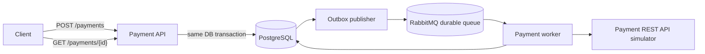

# Payment Processing Application

Reliable asynchronous payment processing implementation using Spring Boot 3, Java 21, PostgreSQL, RabbitMQ, Flyway, and a configurable Payment Service simulator.

## Documentation Map

Start with this README for architecture, trade-offs, and run commands. `SUBMISSION_NOTE.md` is a shorter design and verification summary, while `TEST_REPORT.md` contains the fuller test evidence, scaling checks, observations, and optimization ideas.

## Design Summary

`POST /payments` is intentionally asynchronous. It validates and persists the request, creates a transactional outbox event, and returns `202 Accepted` with a `paymentId` and `statusUrl`. A background publisher moves outbox events to RabbitMQ, and workers call the external Payment REST API simulator later.

This design favors restart safety, retry visibility, and horizontal scaling over immediate synchronous completion. The main trade-off is that clients must poll `GET /payments/{paymentId}` for the final result.

## Specification-Driven Workflow

This project uses Spec Kit's lightweight `spec -> plan -> tasks` workflow rather than OpenSpec. The product requirements are captured in `specs/payment-processing/spec.md`, the engineering approach in `specs/payment-processing/plan.md`, the durable state design in `specs/payment-processing/data-model.md`, the implementation ledger in `specs/payment-processing/tasks.md`, and the public contract in `specs/payment-processing/contracts/openapi.yaml`.

Those artifacts shaped the implementation by making restart safety, explicit payment state, idempotency, retry handling, and horizontal scaling acceptance criteria before coding the API and worker flow.

## Design Decisions And Trade-Offs

| Decision | Choice | Why | Trade-off |
| --- | --- | --- | --- |
| Public API style | Asynchronous `POST /payments` returning `202 Accepted` | Keeps intake fast, makes retries visible, survives process restarts, and supports multiple workers | Clients need to poll the status endpoint instead of receiving the final result immediately |
| Synchronous alternative | Rejected for the core API | A synchronous call would be simpler for clients but would tie request latency and availability to the external Payment REST API | Harder to make restart-safe and harder to scale horizontally under slow or flaky external calls |
| Queueing pattern | Transactional outbox plus RabbitMQ | Avoids losing work between DB commit and message publish | Outbox publisher adds moving parts and eventual consistency |
| Delivery semantics | At-least-once processing | Matches RabbitMQ redelivery and worker retry behavior honestly | Duplicate deliveries are expected and handled with idempotent terminal-state no-ops |
| External side effects | Idempotent or reconcilable calls using the local `paymentId` | A local DB commit and external REST response cannot be atomic without a distributed transaction | Correctness relies on the external service honoring idempotency or exposing reconciliation by request key |
| Retry policy | Retry technical failures, fail business declines terminally | Timeouts, HTTP 5xx, and HTTP 429 are usually transient; declines are business outcomes | Requires careful classification and attempt history |
| Scaling proof | Docker Compose with `--scale payment-app=3` | Reproducible locally and enough to prove stateless app replicas with shared DB/RabbitMQ | Kubernetes manifests are left optional instead of being the core deliverable |
| Simulator | Same jar, separate `simulator` profile | Keeps setup simple while making failure modes configurable | Simulator is deterministic for special references and not a substitute for a real provider contract |

## Architecture



Core reliability model:

- payment row and outbox event are stored atomically;
- RabbitMQ messages are durable;
- workers use manual acknowledgements;
- a message is acknowledged only after durable DB state is written;
- terminal states are immutable for duplicate or redelivered messages;
- processing is at-least-once with idempotent or reconcilable side effects.

The REST response from the simulator and the local DB commit cannot be made atomic without a distributed transaction. The worker therefore sends a stable idempotency key derived from the local `paymentId` so external retries can be deduplicated or reconciled.

## API

Create a payment:

```bash
curl -i -X POST http://localhost:8080/payments \
  -H 'Content-Type: application/json' \
  -d '{"amount":12.50,"currency":"EUR","reference":"INV-100","idempotencyKey":"client-key-100"}'
```

Get status:

```bash
curl -s http://localhost:8080/payments/{paymentId}
```

Get attempts:

```bash
curl -s http://localhost:8080/payments/{paymentId}/attempts
```

OpenAPI contract: `specs/payment-processing/contracts/openapi.yaml`.

## Idempotency

If `idempotencyKey` is provided, the service stores a canonical request hash over amount, currency, and reference.

- Same key and same payload: returns the existing payment.
- Same key and changed payload: returns `409 Conflict`.
- Missing key: creates a new payment.

## Retry Behavior

Technical failures are retryable:

- timeout or unexpected runtime exception;
- HTTP 5xx;
- HTTP 429.

Business declines are terminal `FAILED`. Retry backoff is exponential and configurable:

- `PAYMENT_MAX_ATTEMPTS`
- `PAYMENT_INITIAL_BACKOFF`
- `PAYMENT_BACKOFF_MULTIPLIER`
- `PAYMENT_MAX_BACKOFF`
- `PAYMENT_STALE_IN_PROGRESS_AFTER`

Stale `IN_PROGRESS` rows are moved back to `RETRY_PENDING` by a recovery scheduler.

## Simulator Behavior

The simulator runs from the same jar with `--spring.profiles.active=simulator` and exposes `POST /simulator/payments`.

References with special behavior:

- contains `DECLINE`: returns a business decline;
- contains `ERROR`: returns a technical failure;
- otherwise returns approved, unless random simulator rates are configured.

Simulator randomness is controlled by:

- `PAYMENT_SIMULATOR_MIN_DELAY`
- `PAYMENT_SIMULATOR_MAX_DELAY`
- `PAYMENT_SIMULATOR_TECHNICAL_FAILURE_RATE`
- `PAYMENT_SIMULATOR_BUSINESS_DECLINE_RATE`

## Run Tests

```bash
mvn test
```

The repository includes a GitHub Actions workflow at `.github/workflows/ci.yml` that runs the Maven test suite on push, pull request, and manual dispatch.

A project-local Maven cache can be used if desired:

```bash
mvn -Dmaven.repo.local=.m2/repository test
```

The full suite includes a Testcontainers integration test that starts PostgreSQL and RabbitMQ and verifies API intake through outbox publishing, RabbitMQ worker consumption, and DB finalization. When using Colima, export the Docker socket settings before running the suite:

```bash
export DOCKER_HOST=unix://$HOME/.colima/default/docker.sock
export TESTCONTAINERS_DOCKER_SOCKET_OVERRIDE=/var/run/docker.sock
mvn -Dmaven.repo.local=.m2/repository test
```

## Run With Docker Compose

```bash
docker compose up --build
```

The public API is exposed through the gateway at `http://localhost:8080`. RabbitMQ management is available at `http://localhost:15672` with `guest` / `guest`.

Run the smoke test:

```bash
./scripts/smoke-test.sh
```

Run the fuller E2E verification:

```bash
./scripts/e2e-verify.sh
```

## Scaling Proof

Docker Compose is the primary reproducible scaling setup:

```bash
docker compose up --build --scale payment-app=3
```

The `payment-gateway` service keeps a single host port while multiple `payment-app` containers consume the same RabbitMQ queue and share PostgreSQL state.

Optional load check:

```bash
k6 run k6/payment-flow.js
```

## Project Structure

- `src/main/java/com/example/paymentapp/api`: public REST API
- `src/main/java/com/example/paymentapp/domain`: state machine and entities
- `src/main/java/com/example/paymentapp/outbox`: transactional outbox publisher
- `src/main/java/com/example/paymentapp/worker`: RabbitMQ consumer and external call handling
- `src/main/java/com/example/paymentapp/simulator`: configurable simulator
- `src/main/resources/db/migration`: Flyway schema
- `specs/payment-processing`: spec, plan, data model, task ledger, OpenAPI contract
- `TEST_REPORT.md`: verification evidence

## Known Limitations

- The implementation does not claim generic exactly-once processing.
- External side effects depend on idempotency or reconciliation by request key.
- Docker Compose is the primary horizontal scaling proof; Kubernetes manifests are intentionally outside the core deliverable.
