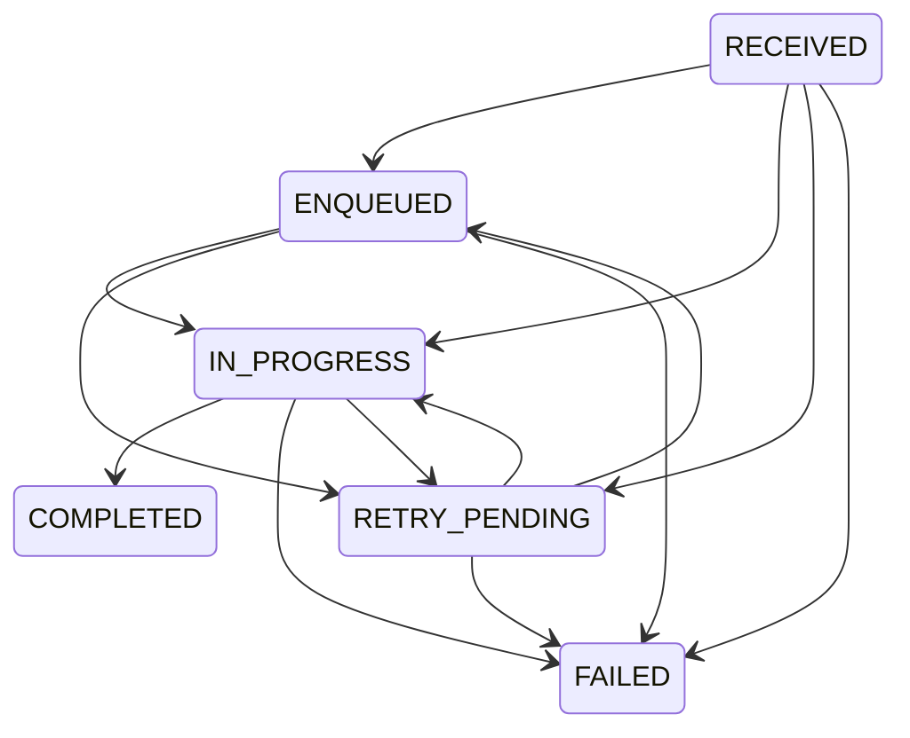

# Payment Processing Spec

## Goal

Provide a reliable payment processing API that accepts payment requests quickly, persists them durably, and processes the external Payment REST API asynchronously through a worker pipeline.

## Public API

- `POST /payments`
  - Persists the request and a matching outbox event in one database transaction.
  - Returns `202 Accepted` with `paymentId`, current state, and `statusUrl`.
  - Supports optional `idempotencyKey`.
- `GET /payments/{paymentId}`
  - Returns the current state, final result or error, attempts, and timestamps.
- `GET /payments/{paymentId}/attempts`
  - Returns individual attempt history for visibility and tests.

## State Machine

Terminal states are `COMPLETED` and `FAILED`. Terminal records are immutable for duplicate or redelivered messages.

## Reliability Requirements

- Store the payment row and outbox event atomically.
- Publish RabbitMQ messages only from durable outbox rows.
- Use durable RabbitMQ queues and manual acknowledgement.
- Acknowledge a worker message only after the payment state, attempt row, and retry or terminal result are committed.
- Retry technical failures such as timeouts, HTTP 5xx, and HTTP 429 with exponential backoff.
- Treat business declines as terminal `FAILED`.
- Recover stale `IN_PROGRESS` records after restart.
- Do not claim exactly-once processing. The design provides at-least-once processing with idempotent or reconcilable external side effects.

## Idempotency

If an idempotency key is supplied, the first request stores a canonical request hash. Later requests with the same key and the same hash return the original payment. Later requests with the same key and a different hash return `409 Conflict`.

The worker calls the simulator with the stable payment id as part of the idempotency key. This makes retries and duplicate deliveries safe when the external service honors idempotent requests or exposes reconciliation by request key.

## Non-Goals

- Generic exactly-once processing.
- Kubernetes as the primary proof of scalability.
- Synchronous external Payment REST API completion inside `POST /payments`.

## Acceptance Criteria

- Unit tests cover state transitions, idempotency hashing, retry policy, intake behavior, and worker state handling.
- Docker Compose runs PostgreSQL, RabbitMQ, the simulator, the payment app, and a gateway.
- `docker compose up --build --scale payment-app=3` is the primary scaling command.
- README documents async trade-offs, idempotency, retry behavior, simulator behavior, scalability setup, and limitations.
